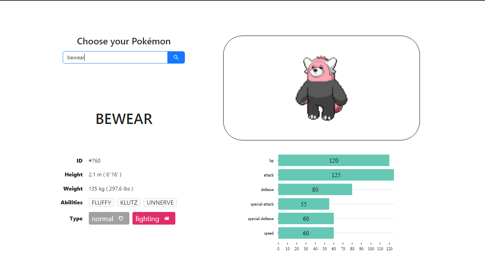
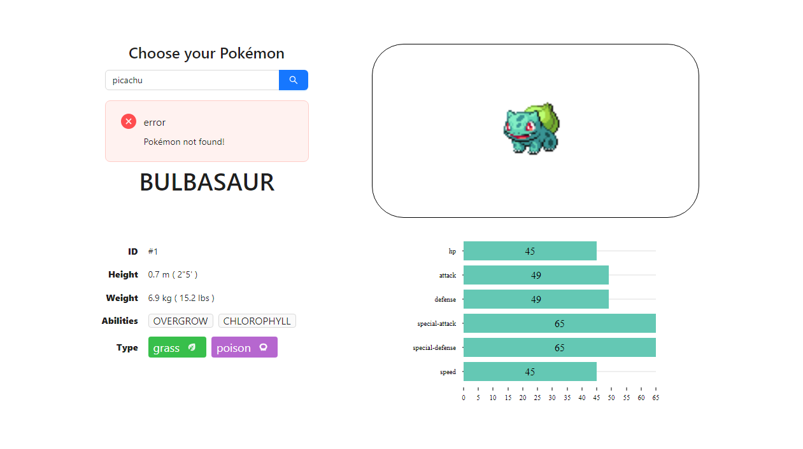
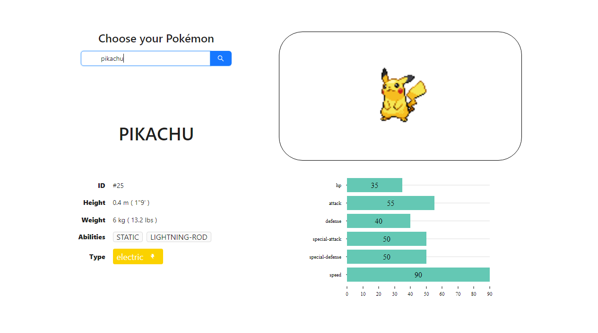
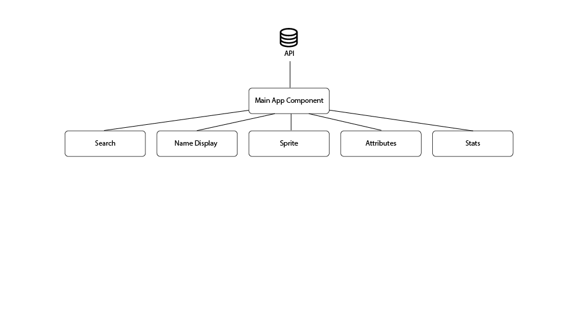
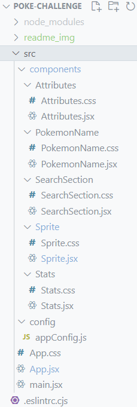

# Pokémon stats web app

## Product
The product is a web application that lets users search a Pokémon species in the PokéAPI and shows back its data. The interface renders the species name, a front image, various attributes and a barchart with the species' stats.

It can be visited [here](https:pokestats.augustolle.com).

## Screenshots

## Technologies
[React](https:react.dev), [Vite](https:vitejs.dev), [Ant Design](https:ant.design), [Nivo](https:nivo.rocks), npm 

## Architecture

Fetch is made from App. jsx component, using default prompt (on load) or the input data from the SearchSection.jsx component. Then, data is passed as prop to the rest of components.

## Folder structure

Each react component other than App.jsx (in root) is located in a separate folder with its CSS styles file.

## Modules

### App.jsx
Main module, receives prompt from Search Section, passing setter as prop, then fetches data from API and serves to other components.

### SearchSection.jsx
Receives setPokemonName function from App.jsx to set the state of the prompt for the API fetch with it input value, and error (boolean).
Renders a search input.
In case of error, renders error message.

### Sprite.jsx
Receives the pokemon data (object) as prop and renders the sprite image from it.

### PokemonName.jsx
Receives the pokemon data (object) as prop and renders the species name from it.

### Attributes.jsx
Receives the pokemon data (object) as prop and renders the following attributes:
ID (number), Height (number), Weight (number), Abilities (array) and Type (array).
Height and Weight are converted to international system unities and then to imperial system units on the render.

### Stats.jsx
Receives the pokemon data (object) as prop and renders bar chart with the stats from it, using Nivo library.

## Backend API
All data is fetched from the [PokéAPI](https://pokeapi.co/) project.

